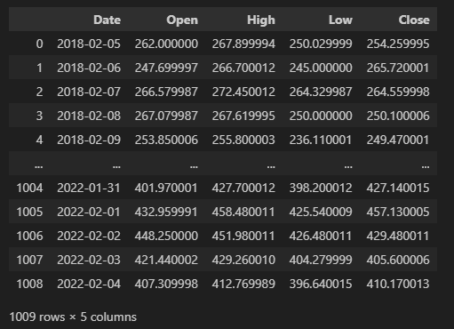
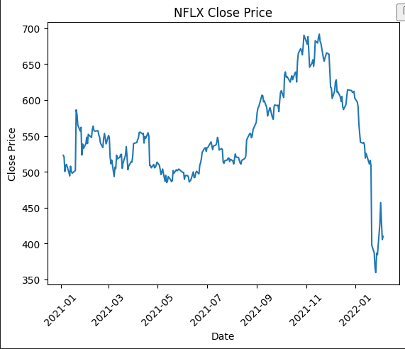
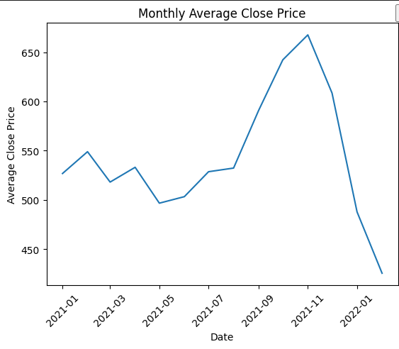
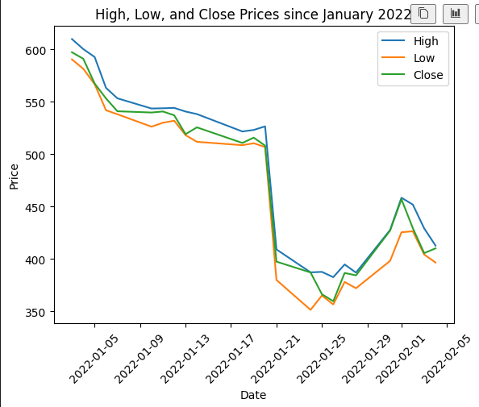

## 1. Pandas 를 사용하여 csv 파일(NLFX.csv)을 DataFrame 으로 읽어오기

pandas 모듈을 import, 읽을 csv 파일의 경로를 설정한 뒤, `pd.read_csv()`를 통해 csv 파일을 읽은 뒤, 출력하였다.

```python
import pandas as pd
csv_path = 'NFLX.csv' # 같은 폴더 내에 존재하므로 파일명으로 경로 설정
df = pd.read_csv(csv_path, usecols=range(0,5)) # 데이터 전처리 
df
```




## 2. csv 파일을 DataFrame 으로 읽어와 2021년 이후의 데이터만 필터링하기

2021년 이후로의 데이터만을 출력하기 위해 날짜 문자열을 `pd.to_datetime()`로 datetime으로 변환한 뒤, 만족하는 값들을 df_after_2021에 저장하였다. 이후, matplotlib를 통해 x축을 날짜, y축을 종가로 한 그래프를 출력하였다. 

```python
# problem B
# 데이터 전처리 - 2021년 이후의 종가 데이터 출력하기 

import pandas as pd
import matplotlib.pyplot as plt

csv_path = 'NFLX.csv' 
data = pd.read_csv(csv_path)
# 특정 열만 출력하기
columns = ['Date', 'Open', 'High', 'Low', 'Close']
df = pd.DataFrame(data, columns=columns)
# 자료형 변환 
df['Date'] = pd.to_datetime(df['Date'])
filter_year = pd.to_datetime('2021-01-01')
# df_after_2021에 2021년도 이후의 날짜인 데이터들만 저장 
df_after_2021 = df[df['Date']>=filter_year]

# 그래프 그리기
plt.plot(df_after_2021['Date'], df_after_2021['Close'])

# 그래프 제목 설정
plt.title('NFLX Close Price')

# x축 레이블 설정
plt.xlabel('Date')
plt.xticks(rotation=45)
# y축 레이블 설정
plt.ylabel('Close Price')

plt.show()
```




## 3. 2021년 이후 최고, 최저 종가 출력하기

특정 열만 출력한 뒤, `pd.DataFrame()`를 통해 데이터프레임을 만들었다. 이후, pandas에 내장되어있는 `.max()`, `.min()`을 통해 종가의 최댓값과 최솟값을 변수에 저장한 뒤, 출력하였다.

```python
import pandas as pd

csv_path = 'NFLX.csv' 
data = pd.read_csv(csv_path)
# 특정 열만 출력하기
columns = ['Date', 'Open', 'High', 'Low', 'Close']
df = pd.DataFrame(data, columns=columns)
# 자료형 변환 
df['Date'] = pd.to_datetime(df['Date'])
filter_year = pd.to_datetime('2021-01-01')
# df_after_2021에 2021년도 이후의 날짜인 데이터들만 저장 
df_after_2021 = df[df['Date']>=filter_year]

max_price = df_after_2021['Close'].max()
min_price = df_after_2021['Close'].min()
print('최고 종가:', max_price)
print('최저 종가:', min_price)
```


## 4. 2021년 이후 월 별 평균 종가 출력하기(월 별로 그룹화)

`groupby()`, `dt.to_period("M")`을 이용하여 월별로 값이 정리되게 하였고, `[Close].mean()`을 이용하여 월별로 저장된 값의 평균을 출력하게 하였다. `dt.to_perid()`는 기간 타입의 데이터기 때문에 그래프로 출력할 수 없기에 `pd.to_timestamp()`를 이용하여 다시 데이터 형식을 변경한뒤, 그래프를 출력하였다. 

```python
import pandas as pd
import matplotlib.pyplot as plt

csv_path = 'NFLX.csv' 
data = pd.read_csv(csv_path)
# 특정 열만 출력하기
columns = ['Date', 'Open', 'High', 'Low', 'Close']
df = pd.DataFrame(data, columns=columns)
# 자료형 변환 
df['Date'] = pd.to_datetime(df['Date'])
filter_year = pd.to_datetime('2021-01-01')
# df_after_2021에 2021년도 이후의 날짜인 데이터들만 저장 
df_after_2021 = df[df['Date']>=filter_year]

monthly_avg_close = df_after_2021.groupby(df_after_2021['Date'].dt.to_period("M"))['Close'].mean()
monthly_avg_close = pd.DataFrame(monthly_avg_close)
# 그래프 그리기
plt.plot(monthly_avg_close.index.to_timestamp(), monthly_avg_close)

# 그래프 제목 설정
plt.title('Monthly Average Close Price')

# x축 레이블 설정
plt.xlabel('Date')
plt.xticks(rotation=45)
# y축 레이블 설정
plt.ylabel('Average Close Price')

plt.show()
```



## 5. 2022년 이후 최고, 최저, 종가 시각화하기

문제 2번과 동일하게 데이터 타입을 변경한 뒤, 2022년 이후 데이터를 데이터프레임으로 저장한뒤, 최고가, 최저가, 종가 총 3개의 그래프를 그렸다. 

```python
import pandas as pd
import matplotlib.pyplot as plt

csv_path = 'NFLX.csv' 
data = pd.read_csv(csv_path)
# 특정 열만 출력하기
columns = ['Date', 'Open', 'High', 'Low', 'Close']
df = pd.DataFrame(data, columns=columns)
# 자료형 변환 
df['Date'] = pd.to_datetime(df['Date'])
# 2022년 이후 데이터만 저장
filter_year_2022 = pd.to_datetime('2022-01-01')
df_after_2022 = df[df['Date']>=filter_year_2022]

plt.plot(df_after_2022['Date'],df_after_2022['High'],label='High')
plt.plot(df_after_2022['Date'],df_after_2022['Low'],label='Low')
plt.plot(df_after_2022['Date'],df_after_2022['Close'],label='Close')

plt.title('High, Low, and Close Prices since January 2022')
plt.xlabel('Date')
plt.ylabel('Price')
plt.xticks(rotation=45)
plt.legend()
```




csv파일을 pandas, matplotlit를 통해 사용자가 원하는대로 출력, 수정하며 그래프로 시각적인 효과를 제공할 수 있었다. 